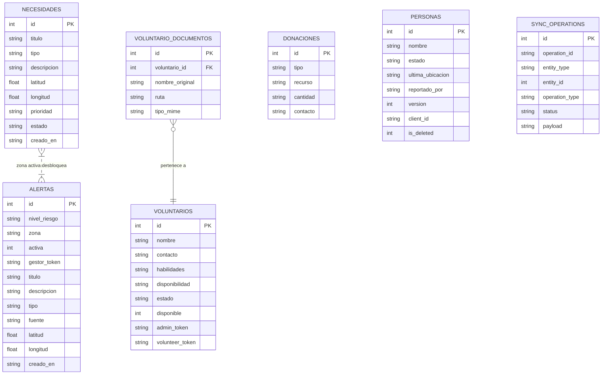

# Modelo Entidad-Relación — Nexo (fuente única de verdad)

> Borrador de consenso del modelo de datos. Toda columna o tabla nueva se
> acuerda AQUÍ primero y luego se implementa en una sola migración, para
> evitar conflictos al integrar ramas (el problema detectado en el PR #33).

## Entidades y atributos

### necesidades (núcleo)
- `id` PK · `titulo` · `tipo` (CHECK: agua/alimento/medicina/refugio/herramientas/transporte)
- `descripcion` · `latitud` REAL · `longitud` REAL · `prioridad` (CHECK) · `estado` (CHECK) · `creado_en`

### voluntarios
- `id` PK · `nombre` · `contacto` · `habilidades` · `disponibilidad` · `creado_en`
- `estado` (CHECK: pendiente/aprobado/rechazado) · `disponible` (0/1)
- `admin_token` · `volunteer_token`
- **FK:** `voluntario_documentos.voluntario_id` → `voluntarios.id` (ON DELETE CASCADE)

### voluntario_documentos
- `id` PK · `voluntario_id` FK · `nombre_original` · `ruta` · `tipo_mime` · `creado_en`

### donaciones (parte de Ayudas — recurso/servicio)
- `id` PK · `tipo` · `recurso` · `cantidad` · `contacto` · `creado_en`

### alertas (núcleo, Grupo 2 — activación de crisis)
- `id` PK · `nivel_riesgo` (CHECK: bajo/medio/alto) · `zona` TEXT (GeoJSON Polygon)
- `activa` INTEGER (0/1) · `gestor_token` · `titulo` · `descripcion`
- `tipo` (opcional, reusa EventTypeEnum) · `fuente` (DEFAULT 'gestor')
- `latitud` REAL · `longitud` REAL · `creado_en`
- Creada en `004_alertas_gestor.sql` (Sprint 2, acordada en este modelo).

### ayudas (concepto Sprint 2 — unifica donación + voluntariado)
- Módulo de negocio que agrupa `donaciones` (tipos `recursos`/`servicios`) y
  `voluntarios` (tipo `tiempo`/voluntariado, con `nombre` + `DNI`).
- Contrato hacia el mapa: `{id, type, category, latitude, longitude, status}`.
- No es una tabla nueva en el MVP: reutiliza `donaciones` y `voluntarios`.

### personas (registro "estoy bien" + sincronización offline)
- `id` PK · `nombre` · `estado` (desaparecida/localizada/estoy_bien) · `ultima_ubicacion`
- `reportado_por` · `creado_en`
- `version` INTEGER DEFAULT 1 · `client_id` TEXT · `updated_at` TIMESTAMP · `is_deleted` INTEGER DEFAULT 0
  (de `002_sync_setup.sql`)
- `edad` INTEGER · `descripcion` TEXT  ← **REQUERIDAS por el código G4; actualmente AUSENTES en migraciones**

### sync_operations (auditoría de sincronización offline)
- `id` PK · `operation_id` UNIQUE · `entity_type` · `entity_id` · `operation_type` (CHECK)
- `status` (CHECK) · `payload` (JSON) · `client_created_at` · `server_processed_at`
- `error_code` · `error_message` · `created_at`

### sync_log (LEGACY)
- `id` PK · `modulo` · `accion` · `payload` · `procesado_en`
- Creada en `001_init.sql`; **solapa con `sync_operations`** → decidir deprecar.

## Relaciones
- `voluntario_documentos` N:1 `voluntarios`.
- `sync_operations` referencia cualquier entidad por `(entity_type, entity_id)` — relación
  débil/polimórfica, sin FK estricta (por diseño de sync offline).
- `ayudas` (módulo) agrupa `donaciones` y `voluntarios` (sin FK nueva; es un criterio de negocio).
- `alertas` (gestor) es independiente en BD, pero por **lógica de activación** desbloquea
  `necesidades` y `ayudas` cuya zona/coordenadas caen dentro de su `zona` cuando `status = alto_riesgo`.
- Contratos hacia el mapa (no persistidos): `alerta→mapa {id, risk_level, status, zone}`,
  `necesidad→mapa {id, type, latitude, longitude, status}`,
  `ayuda→mapa {id, type, category, latitude, longitude, status}`.

## Diagrama (Mermaid)

> `AYUDAS` es un módulo de negocio (no tabla): agrupa `DONACIONES` y `VOLUNTARIOS`.
> `ALERTAS` desbloquea `NECESIDADES`/ayudas por coincidencia de zona (lógica, no FK).

## Conflictos detectados al integrar (histórico)
1. `personas` se altera en `002_sync_setup.sql` (version/client_id/updated_at/is_deleted) y el
   PR #33 de Isabela **elimina esos ALTERs**, pero su código usa `edad`/`descripcion` que no
   existen en ninguna migración → conflicto de merge y tabla incompleta.
2. Dos tablas de sync (`sync_log` y `sync_operations`) con propósitos solapados.
3. `edad` y `descripcion` requeridas por el código G4 no están en ninguna migración.
4. Dos archivos con prefijo `002_` → orden frágil y edición concurrente del mismo `.sql`.
5. `alertas` (Grupo 2) añadida en Sprint 2 vía `004_alertas_gestor.sql`; ya acordada en este modelo, sin solape con las tablas existentes.

## Propuesta de reconciliación
- **Fuente única:** este modelo ER. Toda decisión de datos se acuerda aquí.
- **`personas`:** definir todas sus columnas (incl. `edad`, `descripcion`) en UN solo lugar
  (ampliar `002_sync_setup.sql` o crear `003_personas_sync.sql` estable). No volver a editar
  el mismo `.sql` desde varias ramas.
- **Sync:** elegir `sync_operations` como tabla canónica; marcar `sync_log` como legacy.
- **Una migración por cambio de modelo**, numerada en secuencia (`001`, `002`, `003`...),
  sin prefijos duplicados.
